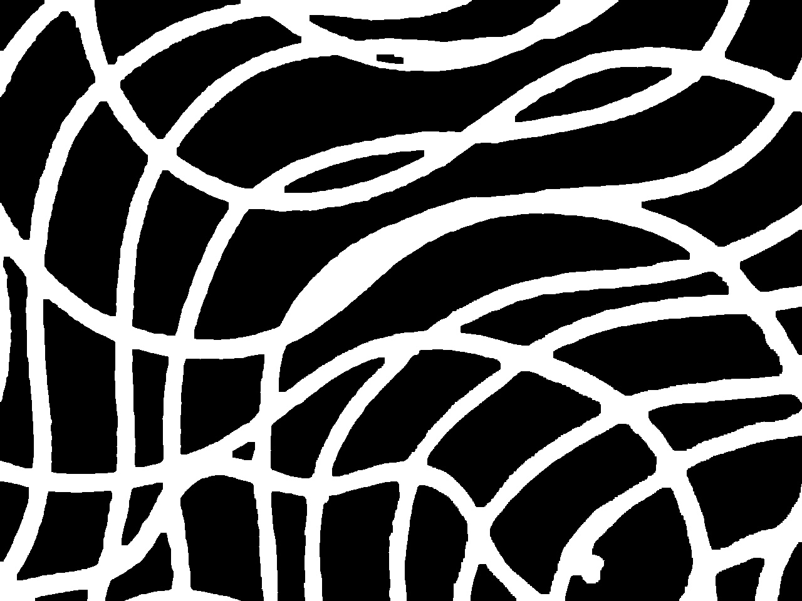
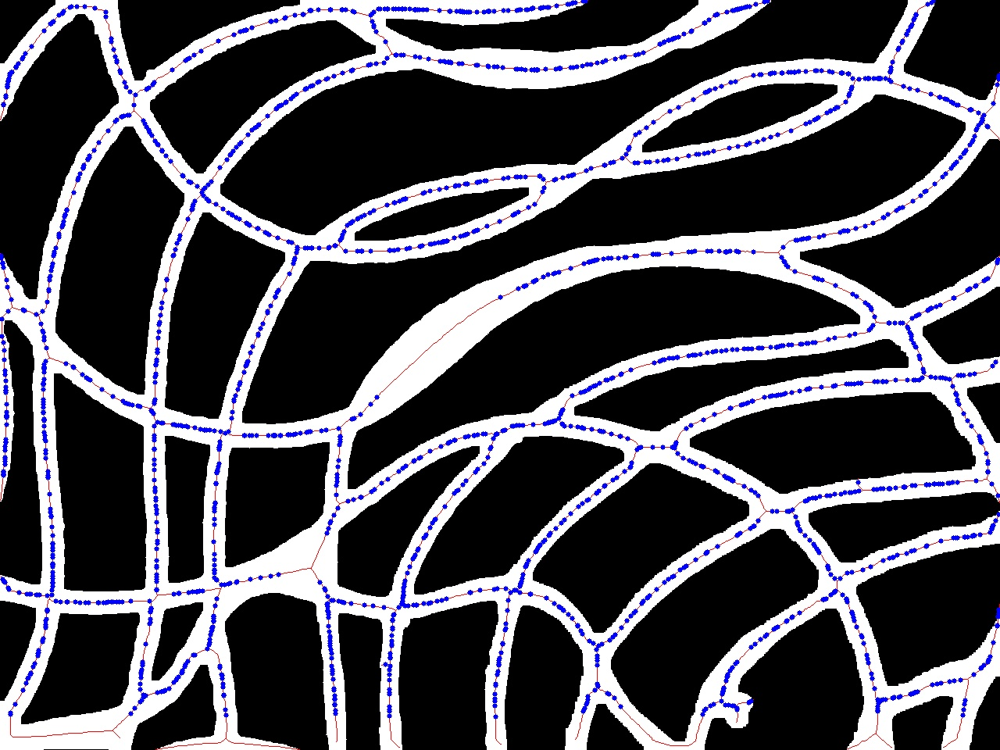

# Fibre Diameter Measurement in Pixel

 Fibre diameter measurement program based on <code>opencv</code>, <code>scipy</code> and <code>torch</code>. Raw image will be processed and binarized via <code>opencv</code> and a pointNet style model, the skeleton of fibre will then be extracted. The diameter measurement is done based on the skeleton, via <code>distance_transform_edt()</code> in <code>scipy</code>. 

 An update on sampling points filtre was laterly added. This new feature takes role in private function <code>_distanceMeasure()</code>. The new feature determines whether a measurement site is valid or not depends on the local geometrical and topological characteristics. This ensures that the measurement wouldn't take place at the fibre fuse or intersection part. 

## Example

 This is a binary mask for fibre thought preliminary image process. 

 The image shown below is returned by <code>measure()</code> API in <code>fibreMeasure</code>. The skeleton and measurement sites are labelled in blue and red respectively. 

 It's noticeable that the measurement wasn't taken place at the two fibre fusing part. 

## Usage
Move all files under the root path of your project, import `fibreMeausre` module via:

    import fibreMeasure

Activate module via:
    
    fibreMeasure.setup()

The default public API for fibreMeasure is `measure()`, it returns the average fibre diameter in pixel for the input image and the labelled binary image showing skeleton and measurement site.

    measure(imgPath: str) -> float, np.ndarray

## License

This project is released under Apache 2.0 license

## Requirements
<ul>
    <li> opencv-python
    <li> numpy
    <li> skimage
    <li> scipy
    <li> torch
    <li> pandas
    <li> sklearn
    <li> tqdm
    <li> matplotlib
</ul>

## Other Notice

Currently no error handling mechanism developed, so be careful to input the correct `imgPath` into the `measure()` function.

